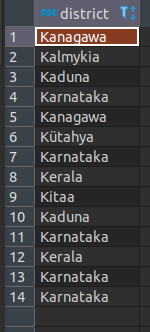
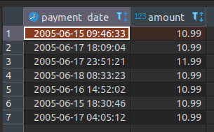
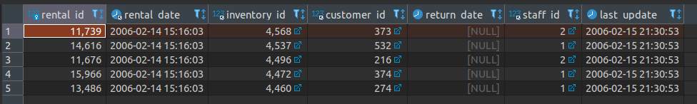
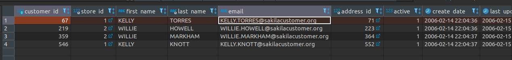
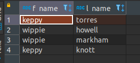
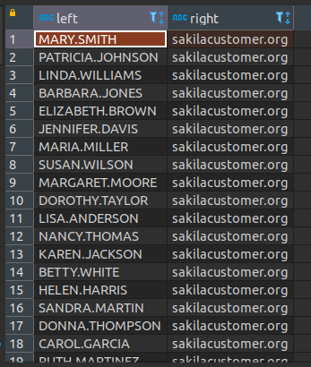
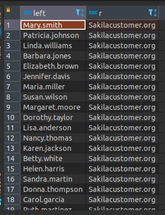

# Домашнее задание к занятию "12.3 "Реляционные базы данных: SQL. Часть 1" - Рыжиков Вячеслав


### Инструкция по выполнению домашнего задания

   1. Сделайте `fork` данного репозитория к себе в Github и переименуйте его по названию или номеру занятия, например, https://github.com/имя-вашего-репозитория/git-hw или  https://github.com/имя-вашего-репозитория/7-1-ansible-hw).
   2. Выполните клонирование данного репозитория к себе на ПК с помощью команды `git clone`.
   3. Выполните домашнее задание и заполните у себя локально этот файл README.md:
      - впишите вверху название занятия и вашу фамилию и имя
      - в каждом задании добавьте решение в требуемом виде (текст/код/скриншоты/ссылка)
      - для корректного добавления скриншотов воспользуйтесь [инструкцией "Как вставить скриншот в шаблон с решением](https://github.com/netology-code/sys-pattern-homework/blob/main/screen-instruction.md)
      - при оформлении используйте возможности языка разметки md (коротко об этом можно посмотреть в [инструкции  по MarkDown](https://github.com/netology-code/sys-pattern-homework/blob/main/md-instruction.md))
   4. После завершения работы над домашним заданием сделайте коммит (`git commit -m "comment"`) и отправьте его на Github (`git push origin`);
   5. Для проверки домашнего задания преподавателем в личном кабинете прикрепите и отправьте ссылку на решение в виде md-файла в вашем Github.
   6. Любые вопросы по выполнению заданий спрашивайте в чате учебной группы и/или в разделе “Вопросы по заданию” в личном кабинете.
   
Желаем успехов в выполнении домашнего задания!
   
### Дополнительные материалы, которые могут быть полезны для выполнения задания

1. [Руководство по оформлению Markdown файлов](https://gist.github.com/Jekins/2bf2d0638163f1294637#Code)

---

### Задание 1

```sql
SELECT
	a.district
FROM
	sakila.address a
WHERE
	left(district ,
	1) = 'K'
	AND RIGHT (district,
	1) = 'a'
	AND INSTR(district, ' ') = 0;
```




---

### Задание 2

```sql
SELECT
	p.payment_date,
	amount
FROM
	sakila.payment p
WHERE
	payment_date 
BETWEEN '2005-06-15 00:00:00' AND '2005-06-18 23:59:59'
	AND amount > 10;
```




************
<ins><span style="color:blue">
SELECT CAST ( p.payment_date  AS DATE ) ddd FROM sakila.payment p; <br> 
SQL Error [1584] [42000]: Incorrect parameters in the call to stored function `CAST` <br> 
CAST Не работает Почему?</span></ins>
************

---

### Задание 3

```sql
SELECT
	*
FROM
	sakila.rental r
ORDER BY
	rental_date DESC
LIMIT 5;
```



### Задание 4

```sql
SELECT
	*
FROM
	sakila.customer c
WHERE
	first_name = 'KELLY'
	OR first_name = 'WILLIE';
```



```sql
SELECT
	REPLACE (LOWER(first_name),
	'll',
	'pp') f_name ,
	LOWER(last_name) l_name
FROM
	sakila.customer c
WHERE
	first_name = 'KELLY'
	OR first_name = 'WILLIE';
```



---
## Дополнительные задания (со звездочкой*)

Эти задания дополнительные (не обязательные к выполнению) и никак не повлияют на получение вами зачета по этому домашнему заданию. Вы можете их выполнить, если хотите глубже и/или шире разобраться в материале.

### Задание 5


```sql
SELECT
	LEFT (c.email,
	INSTR(c.email, '@')-1) 'left',
	RIGHT (c.email ,
	CHAR_LENGTH(c.email)-INSTR(c.email, '@')) 'right'
FROM
	sakila.customer c ;
```




************
<ins>
POSITION ('@' IN c.email)<br>
<br>
не работает<br>
<br>
SQL Error [1064] [42000]: You have an error in your SQL syntax; check the manual that corresponds to your<br> 
MySQL server version for the right syntax to use near 'c.email) FROM sakila.customer c' at line 1<br>
<br>
 
Error position:</ins>
************

### Задание 6

```sql
SELECT
	CONCAT(UPPER( LEFT (c.email,1)), LOWER( SUBSTR(c.email , 2, (INSTR(c.email, '@')-2)))) 'left',
	CONCAT( UPPER( SUBSTR(c.email , INSTR(c.email, '@')+1, 1)),
	LOWER( RIGHT (c.email ,
	CHAR_LENGTH(c.email)-INSTR(c.email, '@')-1))) 'r'
	FROM
	sakila.customer c ;
```

	
	
	
